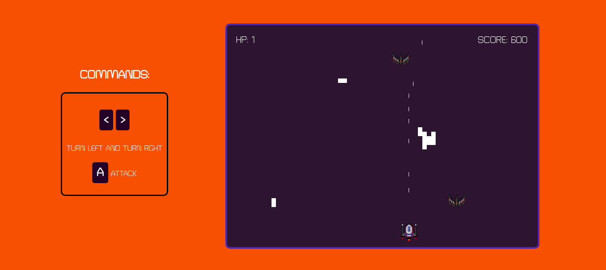

# Space Invader "Clone"
> "Space Invader "Clone" is a game build in HTML canvas, CSS and Javascript.
> This game is in beta version 0.1.0
#### TLDR: https://rafaelsdiasdev.github.io/Space-Invader-Clone/

## Installation

Clone or download this project, open the index.html file in your browser and have Fun. Or just click in this [link](https://rafaelsdiasdev.github.io/Space-Invader-Clone/)!

## Usage example

Instructions to play this game:

* Use your Keyboard to move turn left and right with direction the arrows
* Press "A" to attack enemy ships coming your way
* Up Key to go foward
* Destroy them all!!!

## Release History

* 0.1.0
    * CHANGE: Interplay of gameover and update images ships
* 0.0.1
    * Initial files added

## Meta

Rafael Dias – [@rs_dias](https://twitter.com/rs_dias) – rafaels.dias@me.com

Distributed under the Creative Commons license - Attribution-NonCommercial 4.0 International (CC BY-NC 4.0). See CC LICENSE for more information.

[https://github.com/rafaelsdiasdev/github-link](https://github.com/rafaelsdiasdev)

## Contributing
>This is a free software, feel free to contribute in any way you want

1. Fork it (<https://rafaelsdiasdev.github.io/Space-Invader-Clone/fork>)
2. Create your feature branch (`git checkout -b feature/fooBar`)
3. Commit your changes (`git commit -am 'Add some fooBar'`)
4. Push to the branch (`git push origin feature/fooBar`)
5. Create a new Pull Request
